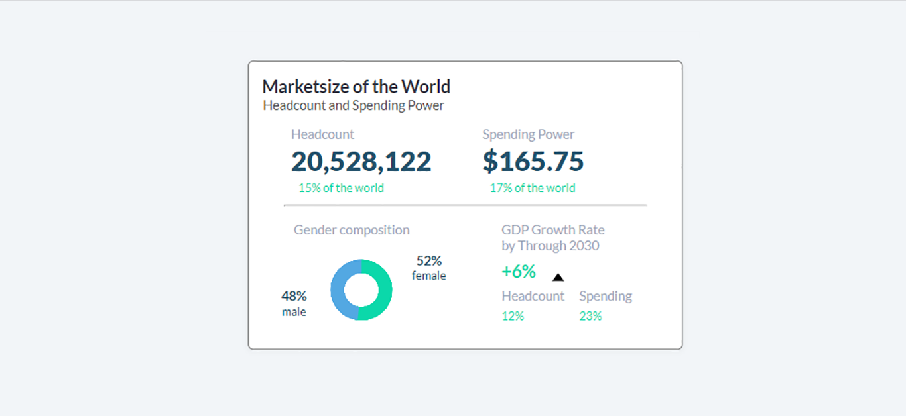

# Marketsize Of The World




### CSS

- Korzystamy tylko i wyłącznie z jednostek miary VW oraz VH.

    Przykład:

    ```html
	h1 {
		font-size:1.2vw
		left:5vw 
		line-height:0.8vw 
	}
    ```
- Wyjątkiem są cienkie linie je można zapisać jako 1px.

- Korzystamy tylko i wyłącznie z czcionki 'Lato'.

- Kolory muszą być 1:1 jak na obrazku


### JavaScript

- Piszemy kod w czystym JS z pomocą jQuery

- Do stworzenia wykresu kołowego korzystamy z biblioteki do proceduralnego generowania SVG - D3.js

- Ogólna funkcja generująca wykres powinna zawierać jeden argument, który odpowiada procentowi wypełnienia niebieskiej części.

- Cały moduł powinien mieć funkcje ustawiającą jego zawartość:

    ```javascript
	 setMarketsize (
		headcount,
		headcount_share,
		spending,
		spending_share,
		gender_percent,
		gdp,
		gdp_headcount,
		gdp_spending
	)
    ```
- Argument __gender_percent__ jest wykorzystywany w funkcji ogólnej generującej wykres kołowy.